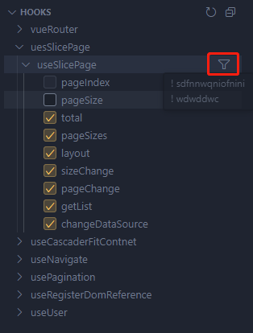
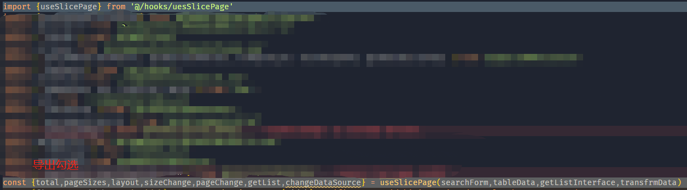

## 功能

统一管理 hooks

## 演示

文件内容示例

```js
//注释
export function a(){
   //foo的注释
   const foo
   return {foo}
}
```


### hover 显示注释，注释需要写在导出内容的上面，// /\*都可，多行也会自动合并


### 点击 hook 函数生成


### 过滤选中




### 注意

没显示出来可能是语法错误，如果文件变化使用刷新按钮（悬浮）

暂不支持函数表达式的写法,建议与export写在一起

```js
//暂不支持
const a = () => {};
export default a;
```
